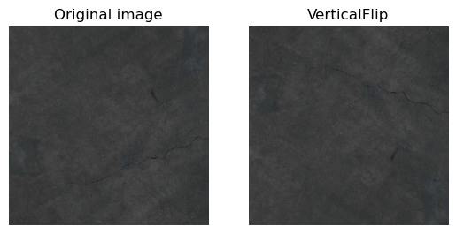

# Cracks Segmentation

Tha goal of this project is to create model to **locate cracks in the road**

See the examples:


## Authors:
- [Krzysztof Skrobała](https://github.com/shhhQuiettt)
- [Wojciech Bogacz](https://github.com/wojbog)

 

```python
import os
import torch
import numpy as np
import matplotlib.pyplot as plt
import random
import albumentations as A
from PIL import Image
import torch
import torch.nn as nn
from torchsummary import summary
import torchvision
from torchmetrics.functional.classification import binary_f1_score
from torchvision.transforms.functional import pil_to_tensor
```

```python
image_dir = "./data/train/images"
mask_dir = "./data/train/masks"
assert os.path.exists(image_dir)
assert os.path.exists(mask_dir)

IMG_SHAPE = (448, 448)
```


```python
def set_seeds():
    torch.manual_seed(0xC0FFEE)
    np.random.seed(0xC0FFEE)
set_seeds()
```

## Helper functions


```python
def get_random_image_and_mask() -> tuple[Image, Image]:
    img_files = [f for f in os.listdir(image_dir)]

    file_name = random.choice(img_files)
    
    
    img_path = os.path.join(image_dir, file_name)
    mask_path = os.path.join(mask_dir, file_name)
    
    image = Image.open(img_path).convert("RGB") 
    
    mask = Image.open(mask_path).convert("L")

    return image, mask

```


```python
def visualise_transform(image, transform):

    transformed_img = transform(image=np.array(image))["image"]
    fig, axs = plt.subplots(1,2)

    axs[0].imshow(image)
    axs[0].set_title("Original image")
    axs[0].axis("off")

    function_name = transform.__class__.__name__
    axs[1].imshow(transformed_img)
    axs[1].set_title(function_name)
    axs[1].axis("off")
    
    

```


```python
def dice_score(prediction_mask, truth_mask):
    return binary_f1_score(prediction_mask.squeeze(), truth_mask.squeeze())
```


```python
def predict(img, *, model):
    if len(img.shape) == 3:
        img = img[None,:,:,:]
    model.eval()
    with torch.no_grad():
        logits = model(img)
        probs = torch.sigmoid(logits)

        mask = probs > 0.5

    return mask.double()
```


```python
def draw_random_predictions(model, num_of_images = 3):
    img_files = [f for f in os.listdir(image_dir)]
    selected_files = random.sample(img_files, num_of_images)

    fig, axs = plt.subplots(num_of_images,3, figsize=(10,10))
    
    for i, file_name in enumerate(selected_files):
        img_path = os.path.join(image_dir, file_name)
        mask_path = os.path.join(mask_dir, file_name)
        
        image = Image.open(img_path).convert("RGB") 
        
        mask = Image.open(mask_path).convert("L")
        
        tensor_image = pil_to_tensor(image).float()/255.0
        tensor_mask = torch.round(pil_to_tensor(mask).float()/255.0)
        
        prediction = predict(tensor_image, model = model)
        dice = dice_score(prediction, tensor_mask)
        
        axs[i,0].set_title("Image")
        axs[i,0].imshow(image)
        
        axs[i,1].set_title(f"Prediction (Dice: {dice:.2f})")
        axs[i,1].imshow(prediction[0,0].cpu(), cmap="gray")
        

        axs[i,2].imshow(tensor_mask.squeeze(), cmap="gray")
        axs[i,2].set_title("Ground Truth")
        

```

# Dataset overview

The dataset contains images of concrete with or without cracks, and masks of cracks


```python
examples = 5
_, axs = plt.subplots(examples, 2, figsize = (8,24))
for i in range(5): 
    image, mask = get_random_image_and_mask()
    axs[i, 0].imshow(image)
    axs[i, 1].imshow(mask, cmap="gray")
    axs[i, 0].axis('off')  
    axs[i, 1].axis('off') 

```


    

    


# Preprocessing


```python
values = np.zeros((256,))
sample_size = 500
for _ in range(sample_size):
    _, mask = get_random_image_and_mask()
    values[np.unique(np.array(mask))] += 1

plt.title(f"Histogram of mask values (random sample of size {sample_size}")
plt.bar(range(256), values)


```


    

    


Some of the values in mask images are not entirely black or white, probably due to compression. Because the variation is very small, we just **round the values** to black or white

We also **normalize the pixels**, so the values lie between **0 and 1**

## Augumentations

We tried to train our networks with or without augumentations. 

When we did use it we concluded that such augumentations make sense


```python
EXMAPLE_PER_TRANSFORM = 3
```

### Rotation

Cracks have an unoriented chaotic nature. Transformed images are different but seem very natural


```python
for _ in range(EXMAPLE_PER_TRANSFORM):
    img, _ = get_random_image_and_mask()
    visualise_transform(img, A.Rotate(limit=(-90,90),p=1))
```


    

    


    

    


    

    


### Vertical Flip

Crack is a crack in its mirror image


```python
for _ in range(EXMAPLE_PER_TRANSFORM):
    img, _ = get_random_image_and_mask()
    visualise_transform(img,  A.VerticalFlip(p=1))
```


    

    


    

    


    

    


### Grid distortion

This transformation apply localized warping effects, by dividing it into a grid and creating localized warping effects. This makes sense, as crack forms a convoluted path, which after distortion still looks like a valid crack 


```python
for _ in range(EXMAPLE_PER_TRANSFORM):
    img, _ = get_random_image_and_mask()
    visualise_transform(img,   A.GridDistortion(p=1))
```


    

    


    

    


    

    


### One of: Random Brightness Contrast or Random Gamma

Some typical tranformation for different illumination


```python
for _ in range(EXMAPLE_PER_TRANSFORM):
    img, _ = get_random_image_and_mask()
    visualise_transform(img, A.RandomBrightnessContrast(p=1))
```


    

    


    

    


    

    


```python
for _ in range(EXMAPLE_PER_TRANSFORM):
    img, _ = get_random_image_and_mask()
    visualise_transform(img, A.RandomGamma(p=1))
```


    

    


    

    


    

    


```python

```

# Model Architecture

All of our models are implementations of **U-net neural network**. We tested training the model from scratch as well as performing transfer learning on deeper encoder with weights employed from **resnet34**

## Architecture 1 (scratch)


```python
class Block(nn.Module):
    def __init__(self, in_channels: int, out_channel: int):
        super().__init__()

        self.net = nn.Sequential(
            nn.Conv2d(in_channels, out_channel, kernel_size=3, padding="same", padding_mode="replicate"),
            nn.ReLU(),
            nn.BatchNorm2d(out_channel),
            
            nn.Conv2d(out_channel, out_channel, kernel_size=3, padding="same", padding_mode="replicate"),
            nn.ReLU(),
            nn.BatchNorm2d(out_channel),
        )

    def forward(self, X):
        return self.net(X)

class Encoder(nn.Module):
    def __init__(self, channels: tuple[int, ...]):
        super().__init__()
        assert channels[0] < channels[1]

        self.blocks = nn.ModuleList(
            [Block(channels[i], channels[i + 1]) for i in range(len(channels) - 1)]
        )
        self.pool = nn.MaxPool2d(kernel_size=2, stride=2)

    def forward(self, X):
        downscaled_features = []
        for block in self.blocks:
            X = block(X)
            downscaled_features.append(X)
            X = self.pool(X)

        return downscaled_features

class Decoder(nn.Module):
    def __init__(self, channels: tuple[int, ...]):
        assert channels[0] > channels[1]

        super().__init__()

        self.blocks = nn.ModuleList(
            [Block(channels[i], channels[i + 1]) for i in range(len(channels) - 1)]
        )
        self.up_convolution = nn.ModuleList(
            [
                nn.ConvTranspose2d(
                    channels[i], channels[i + 1], kernel_size=2, stride=2
                )
                for i in range(len(channels) - 1)
            ]
        )

    def forward(self, X, downscaled_features):
        for i, block in enumerate(self.blocks):
            X = self.up_convolution[i](X)

            # Adding the previously downscaled feature
            feature = downscaled_features[i]
            _, _, h, w = X.shape
            X = torch.cat([X, feature], dim=1)

            X = block(X)

        return X


class UNet(nn.Module):
    def __init__(
        self, encoding_channels: tuple[int, ...], decoding_channels: tuple[int, ...], output_format=(448,448)
    ):
        super().__init__()
        self.encoder = Encoder(encoding_channels)
        self.decoder = Decoder(decoding_channels)
        self.head_out = nn.Conv2d(decoding_channels[-1], 1, kernel_size=1, padding="same", padding_mode="replicate")
        
        self.output_format = output_format

    def forward(self, X):
        features = self.encoder(X)
        X = self.decoder(features[-1], features[::-1][1:])
        X = self.head_out(X)
       
        return X
```


```python

```


```python
endoding_channels = (3, 64, 128, 256, 512, 1024)
decoding_channels = (1024, 512, 256, 128, 64)
model_scratch = UNet(endoding_channels, decoding_channels)
summary(model_scratch, (3,448,448))
```

    ----------------------------------------------------------------
            Layer (type)               Output Shape         Param #
    ================================================================
                Conv2d-1         [-1, 64, 448, 448]           1,792
                  ReLU-2         [-1, 64, 448, 448]               0
           BatchNorm2d-3         [-1, 64, 448, 448]             128
                Conv2d-4         [-1, 64, 448, 448]          36,928
                  ReLU-5         [-1, 64, 448, 448]               0
           BatchNorm2d-6         [-1, 64, 448, 448]             128
                 Block-7         [-1, 64, 448, 448]               0
             MaxPool2d-8         [-1, 64, 224, 224]               0
                Conv2d-9        [-1, 128, 224, 224]          73,856
                 ReLU-10        [-1, 128, 224, 224]               0
          BatchNorm2d-11        [-1, 128, 224, 224]             256
               Conv2d-12        [-1, 128, 224, 224]         147,584
                 ReLU-13        [-1, 128, 224, 224]               0
          BatchNorm2d-14        [-1, 128, 224, 224]             256
                Block-15        [-1, 128, 224, 224]               0
            MaxPool2d-16        [-1, 128, 112, 112]               0
               Conv2d-17        [-1, 256, 112, 112]         295,168
                 ReLU-18        [-1, 256, 112, 112]               0
          BatchNorm2d-19        [-1, 256, 112, 112]             512
               Conv2d-20        [-1, 256, 112, 112]         590,080
                 ReLU-21        [-1, 256, 112, 112]               0
          BatchNorm2d-22        [-1, 256, 112, 112]             512
                Block-23        [-1, 256, 112, 112]               0
            MaxPool2d-24          [-1, 256, 56, 56]               0
               Conv2d-25          [-1, 512, 56, 56]       1,180,160
                 ReLU-26          [-1, 512, 56, 56]               0
          BatchNorm2d-27          [-1, 512, 56, 56]           1,024
               Conv2d-28          [-1, 512, 56, 56]       2,359,808
                 ReLU-29          [-1, 512, 56, 56]               0
          BatchNorm2d-30          [-1, 512, 56, 56]           1,024
                Block-31          [-1, 512, 56, 56]               0
            MaxPool2d-32          [-1, 512, 28, 28]               0
               Conv2d-33         [-1, 1024, 28, 28]       4,719,616
                 ReLU-34         [-1, 1024, 28, 28]               0
          BatchNorm2d-35         [-1, 1024, 28, 28]           2,048
               Conv2d-36         [-1, 1024, 28, 28]       9,438,208
                 ReLU-37         [-1, 1024, 28, 28]               0
          BatchNorm2d-38         [-1, 1024, 28, 28]           2,048
                Block-39         [-1, 1024, 28, 28]               0
            MaxPool2d-40         [-1, 1024, 14, 14]               0
              Encoder-41  [[-1, 64, 448, 448], [-1, 128, 224, 224], [-1, 256, 112, 112], [-1, 512, 56, 56], [-1, 1024, 28, 28]]               0
      ConvTranspose2d-42          [-1, 512, 56, 56]       2,097,664
               Conv2d-43          [-1, 512, 56, 56]       4,719,104
                 ReLU-44          [-1, 512, 56, 56]               0
          BatchNorm2d-45          [-1, 512, 56, 56]           1,024
               Conv2d-46          [-1, 512, 56, 56]       2,359,808
                 ReLU-47          [-1, 512, 56, 56]               0
          BatchNorm2d-48          [-1, 512, 56, 56]           1,024
                Block-49          [-1, 512, 56, 56]               0
      ConvTranspose2d-50        [-1, 256, 112, 112]         524,544
               Conv2d-51        [-1, 256, 112, 112]       1,179,904
                 ReLU-52        [-1, 256, 112, 112]               0
          BatchNorm2d-53        [-1, 256, 112, 112]             512
               Conv2d-54        [-1, 256, 112, 112]         590,080
                 ReLU-55        [-1, 256, 112, 112]               0
          BatchNorm2d-56        [-1, 256, 112, 112]             512
                Block-57        [-1, 256, 112, 112]               0
      ConvTranspose2d-58        [-1, 128, 224, 224]         131,200
               Conv2d-59        [-1, 128, 224, 224]         295,040
                 ReLU-60        [-1, 128, 224, 224]               0
          BatchNorm2d-61        [-1, 128, 224, 224]             256
               Conv2d-62        [-1, 128, 224, 224]         147,584
                 ReLU-63        [-1, 128, 224, 224]               0
          BatchNorm2d-64        [-1, 128, 224, 224]             256
                Block-65        [-1, 128, 224, 224]               0
      ConvTranspose2d-66         [-1, 64, 448, 448]          32,832
               Conv2d-67         [-1, 64, 448, 448]          73,792
                 ReLU-68         [-1, 64, 448, 448]               0
          BatchNorm2d-69         [-1, 64, 448, 448]             128
               Conv2d-70         [-1, 64, 448, 448]          36,928
                 ReLU-71         [-1, 64, 448, 448]               0
          BatchNorm2d-72         [-1, 64, 448, 448]             128
                Block-73         [-1, 64, 448, 448]               0
              Decoder-74         [-1, 64, 448, 448]               0
               Conv2d-75          [-1, 1, 448, 448]              65
    ================================================================
    Total params: 31,043,521
    Trainable params: 31,043,521
    Non-trainable params: 0
    ----------------------------------------------------------------
    Input size (MB): 2.30
    Forward/backward pass size (MB): 2946.12
    Params size (MB): 118.42
    Estimated Total Size (MB): 3066.84
    ----------------------------------------------------------------


## Architecture 2 (Resnet encoder)


```python
import segmentation_models_pytorch as smp

model_transfer = smp.Unet(
    encoder_name="resnet34",       
    encoder_weights="imagenet",
    in_channels=3,
    classes=1,
)
summary(model_transfer,(3,448,448))
```

    ----------------------------------------------------------------
            Layer (type)               Output Shape         Param #
    ================================================================
                Conv2d-1         [-1, 64, 224, 224]           9,408
           BatchNorm2d-2         [-1, 64, 224, 224]             128
                  ReLU-3         [-1, 64, 224, 224]               0
             MaxPool2d-4         [-1, 64, 112, 112]               0
                Conv2d-5         [-1, 64, 112, 112]          36,864
           BatchNorm2d-6         [-1, 64, 112, 112]             128
                  ReLU-7         [-1, 64, 112, 112]               0
                Conv2d-8         [-1, 64, 112, 112]          36,864
           BatchNorm2d-9         [-1, 64, 112, 112]             128
                 ReLU-10         [-1, 64, 112, 112]               0
           BasicBlock-11         [-1, 64, 112, 112]               0
               Conv2d-12         [-1, 64, 112, 112]          36,864
          BatchNorm2d-13         [-1, 64, 112, 112]             128
                 ReLU-14         [-1, 64, 112, 112]               0
               Conv2d-15         [-1, 64, 112, 112]          36,864
          BatchNorm2d-16         [-1, 64, 112, 112]             128
                 ReLU-17         [-1, 64, 112, 112]               0
           BasicBlock-18         [-1, 64, 112, 112]               0
               Conv2d-19         [-1, 64, 112, 112]          36,864
          BatchNorm2d-20         [-1, 64, 112, 112]             128
                 ReLU-21         [-1, 64, 112, 112]               0
               Conv2d-22         [-1, 64, 112, 112]          36,864
          BatchNorm2d-23         [-1, 64, 112, 112]             128
                 ReLU-24         [-1, 64, 112, 112]               0
           BasicBlock-25         [-1, 64, 112, 112]               0
               Conv2d-26          [-1, 128, 56, 56]          73,728
          BatchNorm2d-27          [-1, 128, 56, 56]             256
                 ReLU-28          [-1, 128, 56, 56]               0
               Conv2d-29          [-1, 128, 56, 56]         147,456
          BatchNorm2d-30          [-1, 128, 56, 56]             256
               Conv2d-31          [-1, 128, 56, 56]           8,192
          BatchNorm2d-32          [-1, 128, 56, 56]             256
                 ReLU-33          [-1, 128, 56, 56]               0
           BasicBlock-34          [-1, 128, 56, 56]               0
               Conv2d-35          [-1, 128, 56, 56]         147,456
          BatchNorm2d-36          [-1, 128, 56, 56]             256
                 ReLU-37          [-1, 128, 56, 56]               0
               Conv2d-38          [-1, 128, 56, 56]         147,456
          BatchNorm2d-39          [-1, 128, 56, 56]             256
                 ReLU-40          [-1, 128, 56, 56]               0
           BasicBlock-41          [-1, 128, 56, 56]               0
               Conv2d-42          [-1, 128, 56, 56]         147,456
          BatchNorm2d-43          [-1, 128, 56, 56]             256
                 ReLU-44          [-1, 128, 56, 56]               0
               Conv2d-45          [-1, 128, 56, 56]         147,456
          BatchNorm2d-46          [-1, 128, 56, 56]             256
                 ReLU-47          [-1, 128, 56, 56]               0
           BasicBlock-48          [-1, 128, 56, 56]               0
               Conv2d-49          [-1, 128, 56, 56]         147,456
          BatchNorm2d-50          [-1, 128, 56, 56]             256
                 ReLU-51          [-1, 128, 56, 56]               0
               Conv2d-52          [-1, 128, 56, 56]         147,456
          BatchNorm2d-53          [-1, 128, 56, 56]             256
                 ReLU-54          [-1, 128, 56, 56]               0
           BasicBlock-55          [-1, 128, 56, 56]               0
               Conv2d-56          [-1, 256, 28, 28]         294,912
          BatchNorm2d-57          [-1, 256, 28, 28]             512
                 ReLU-58          [-1, 256, 28, 28]               0
               Conv2d-59          [-1, 256, 28, 28]         589,824
          BatchNorm2d-60          [-1, 256, 28, 28]             512
               Conv2d-61          [-1, 256, 28, 28]          32,768
          BatchNorm2d-62          [-1, 256, 28, 28]             512
                 ReLU-63          [-1, 256, 28, 28]               0
           BasicBlock-64          [-1, 256, 28, 28]               0
               Conv2d-65          [-1, 256, 28, 28]         589,824
          BatchNorm2d-66          [-1, 256, 28, 28]             512
                 ReLU-67          [-1, 256, 28, 28]               0
               Conv2d-68          [-1, 256, 28, 28]         589,824
          BatchNorm2d-69          [-1, 256, 28, 28]             512
                 ReLU-70          [-1, 256, 28, 28]               0
           BasicBlock-71          [-1, 256, 28, 28]               0
               Conv2d-72          [-1, 256, 28, 28]         589,824
          BatchNorm2d-73          [-1, 256, 28, 28]             512
                 ReLU-74          [-1, 256, 28, 28]               0
               Conv2d-75          [-1, 256, 28, 28]         589,824
          BatchNorm2d-76          [-1, 256, 28, 28]             512
                 ReLU-77          [-1, 256, 28, 28]               0
           BasicBlock-78          [-1, 256, 28, 28]               0
               Conv2d-79          [-1, 256, 28, 28]         589,824
          BatchNorm2d-80          [-1, 256, 28, 28]             512
                 ReLU-81          [-1, 256, 28, 28]               0
               Conv2d-82          [-1, 256, 28, 28]         589,824
          BatchNorm2d-83          [-1, 256, 28, 28]             512
                 ReLU-84          [-1, 256, 28, 28]               0
           BasicBlock-85          [-1, 256, 28, 28]               0
               Conv2d-86          [-1, 256, 28, 28]         589,824
          BatchNorm2d-87          [-1, 256, 28, 28]             512
                 ReLU-88          [-1, 256, 28, 28]               0
               Conv2d-89          [-1, 256, 28, 28]         589,824
          BatchNorm2d-90          [-1, 256, 28, 28]             512
                 ReLU-91          [-1, 256, 28, 28]               0
           BasicBlock-92          [-1, 256, 28, 28]               0
               Conv2d-93          [-1, 256, 28, 28]         589,824
          BatchNorm2d-94          [-1, 256, 28, 28]             512
                 ReLU-95          [-1, 256, 28, 28]               0
               Conv2d-96          [-1, 256, 28, 28]         589,824
          BatchNorm2d-97          [-1, 256, 28, 28]             512
                 ReLU-98          [-1, 256, 28, 28]               0
           BasicBlock-99          [-1, 256, 28, 28]               0
              Conv2d-100          [-1, 512, 14, 14]       1,179,648
         BatchNorm2d-101          [-1, 512, 14, 14]           1,024
                ReLU-102          [-1, 512, 14, 14]               0
              Conv2d-103          [-1, 512, 14, 14]       2,359,296
         BatchNorm2d-104          [-1, 512, 14, 14]           1,024
              Conv2d-105          [-1, 512, 14, 14]         131,072
         BatchNorm2d-106          [-1, 512, 14, 14]           1,024
                ReLU-107          [-1, 512, 14, 14]               0
          BasicBlock-108          [-1, 512, 14, 14]               0
              Conv2d-109          [-1, 512, 14, 14]       2,359,296
         BatchNorm2d-110          [-1, 512, 14, 14]           1,024
                ReLU-111          [-1, 512, 14, 14]               0
              Conv2d-112          [-1, 512, 14, 14]       2,359,296
         BatchNorm2d-113          [-1, 512, 14, 14]           1,024
                ReLU-114          [-1, 512, 14, 14]               0
          BasicBlock-115          [-1, 512, 14, 14]               0
              Conv2d-116          [-1, 512, 14, 14]       2,359,296
         BatchNorm2d-117          [-1, 512, 14, 14]           1,024
                ReLU-118          [-1, 512, 14, 14]               0
              Conv2d-119          [-1, 512, 14, 14]       2,359,296
         BatchNorm2d-120          [-1, 512, 14, 14]           1,024
                ReLU-121          [-1, 512, 14, 14]               0
          BasicBlock-122          [-1, 512, 14, 14]               0
       ResNetEncoder-123  [[-1, 3, 448, 448], [-1, 64, 224, 224], [-1, 64, 112, 112], [-1, 128, 56, 56], [-1, 256, 28, 28], [-1, 512, 14, 14]]               0
            Identity-124          [-1, 512, 14, 14]               0
            Identity-125          [-1, 768, 28, 28]               0
           Attention-126          [-1, 768, 28, 28]               0
              Conv2d-127          [-1, 256, 28, 28]       1,769,472
         BatchNorm2d-128          [-1, 256, 28, 28]             512
                ReLU-129          [-1, 256, 28, 28]               0
              Conv2d-130          [-1, 256, 28, 28]         589,824
         BatchNorm2d-131          [-1, 256, 28, 28]             512
                ReLU-132          [-1, 256, 28, 28]               0
            Identity-133          [-1, 256, 28, 28]               0
           Attention-134          [-1, 256, 28, 28]               0
        DecoderBlock-135          [-1, 256, 28, 28]               0
            Identity-136          [-1, 384, 56, 56]               0
           Attention-137          [-1, 384, 56, 56]               0
              Conv2d-138          [-1, 128, 56, 56]         442,368
         BatchNorm2d-139          [-1, 128, 56, 56]             256
                ReLU-140          [-1, 128, 56, 56]               0
              Conv2d-141          [-1, 128, 56, 56]         147,456
         BatchNorm2d-142          [-1, 128, 56, 56]             256
                ReLU-143          [-1, 128, 56, 56]               0
            Identity-144          [-1, 128, 56, 56]               0
           Attention-145          [-1, 128, 56, 56]               0
        DecoderBlock-146          [-1, 128, 56, 56]               0
            Identity-147        [-1, 192, 112, 112]               0
           Attention-148        [-1, 192, 112, 112]               0
              Conv2d-149         [-1, 64, 112, 112]         110,592
         BatchNorm2d-150         [-1, 64, 112, 112]             128
                ReLU-151         [-1, 64, 112, 112]               0
              Conv2d-152         [-1, 64, 112, 112]          36,864
         BatchNorm2d-153         [-1, 64, 112, 112]             128
                ReLU-154         [-1, 64, 112, 112]               0
            Identity-155         [-1, 64, 112, 112]               0
           Attention-156         [-1, 64, 112, 112]               0
        DecoderBlock-157         [-1, 64, 112, 112]               0
            Identity-158        [-1, 128, 224, 224]               0
           Attention-159        [-1, 128, 224, 224]               0
              Conv2d-160         [-1, 32, 224, 224]          36,864
         BatchNorm2d-161         [-1, 32, 224, 224]              64
                ReLU-162         [-1, 32, 224, 224]               0
              Conv2d-163         [-1, 32, 224, 224]           9,216
         BatchNorm2d-164         [-1, 32, 224, 224]              64
                ReLU-165         [-1, 32, 224, 224]               0
            Identity-166         [-1, 32, 224, 224]               0
           Attention-167         [-1, 32, 224, 224]               0
        DecoderBlock-168         [-1, 32, 224, 224]               0
              Conv2d-169         [-1, 16, 448, 448]           4,608
         BatchNorm2d-170         [-1, 16, 448, 448]              32
                ReLU-171         [-1, 16, 448, 448]               0
              Conv2d-172         [-1, 16, 448, 448]           2,304
         BatchNorm2d-173         [-1, 16, 448, 448]              32
                ReLU-174         [-1, 16, 448, 448]               0
            Identity-175         [-1, 16, 448, 448]               0
           Attention-176         [-1, 16, 448, 448]               0
        DecoderBlock-177         [-1, 16, 448, 448]               0
         UnetDecoder-178         [-1, 16, 448, 448]               0
              Conv2d-179          [-1, 1, 448, 448]             145
            Identity-180          [-1, 1, 448, 448]               0
            Identity-181          [-1, 1, 448, 448]               0
          Activation-182          [-1, 1, 448, 448]               0
    ================================================================
    Total params: 24,436,369
    Trainable params: 24,436,369
    Non-trainable params: 0
    ----------------------------------------------------------------
    Input size (MB): 2.30
    Forward/backward pass size (MB): 1006.03
    Params size (MB): 93.22
    Estimated Total Size (MB): 1101.55
    ----------------------------------------------------------------


| | Scratch   | Transfer learning with augumention| Transfer learning without augumentation
| --- | :-------: | :-------: | :-------: |
|**Dice score**| 0.540   | 0.550    | **0.576** |


# Some predictions
We are loading our best model


```python
model_transfer.load_state_dict(torch.load("best_model_transfer_all.pth", map_location="cpu", weights_only=True))
model = model_scratch
```


```python
draw_random_predictions(model)
```


    

    


# Postprocessing

We checked noticed that the predicted masks are very similar to the ground truth ones, but they are thicker. We thought that maybe postprocessing the mask with some computer vision operations like _erosion_ or _opening_ could enhance the result, but unfortunately **every postprocessing operation worsened the results**
